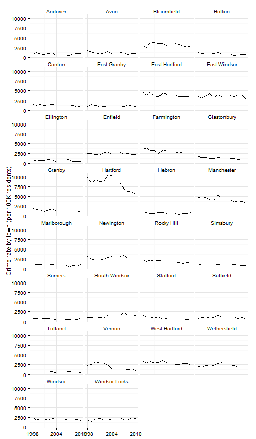
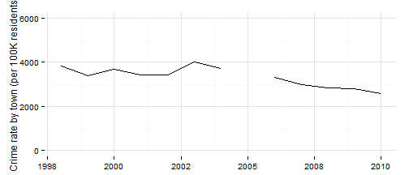

## Crime rates

## Data and limitations

Data on crime rates are available from several sources. The stats here are drawn from the [CTData site](http://ctdata.org/catalog) which draws data from the [Connecticut Department of Public Safety](http://ctdatahaven.org/know/index.php/Juvenile%20arrests,%20Total%20arrests,%2010%20to%2017%20years,%20Rate%20%28per%20100,000%29). 

There are two main national databases for crime data - the [Uniform Crime Reports](http://www.dpsdata.ct.gov/dps/ucr/ucr.aspx) (UCR) and the [National Incident-Based Reporting System](http://www2.fbi.gov/ucr/faqs.htm) (NIBRS). The databases [differ by a few factors](http://blog.spotcrime.com/2012/03/difference-between-ucr-and-nibrs.html), including the degree of detail provided for the crime stats and whether multiple crimes are reported for a single incident or only the most severe offense.  

In addition, comparisons of crime stats should be treated with caution when the comparisons are not for similar geographic units. DataHaven has [written an op-ed](http://www.ctdatahaven.org/blog/2011/06/public_safety_new_haven/) based on misleading use of crime statistics for New Haven in national comparisons.

## What do we already know?

Indicators for crime rates are used in a few reports. 

### Local

* [CT Fair Housing Center Opportunity Mapping](http://www.ctfairhousing.org/people-place-and-opportunity-report/) (developed with the Kirwan Institute at Ohio State) included the crime index or crime rate from Census data.
* [Hartford Neighborhood Assessments](http://courantblogs.com/cityline/wp-content/uploads/2013/04/Hartford-Neighborhood-Assessment.pdf) included Crime per capita data from the	Hartford Police Department. 
* [Health Equity Index](http://www.cadh.org/health-equity/health-equity-index.html) included crimes against persons and crimes against property (per 1000 local residents).
* [Pioneer Valley State of the People](http://pvpc.org/resources/datastats/state-of-people/stateofthepeople2013.pdf) included the crime rate as an indicator.
* [Population Results Working Group](http://www.ct.gov/opm/cwp/view.asp?a=2998&Q=490946) includes the Per Capita Crime Rate (disaggregated by juveniles, violent and property), as well as arrests for domestic violence, both using data from the CT Judicial Branch.

## Other

* [Boston Indicators Project](http://www.bostonindicators.org/) includes rates of Part 1 crime, property crime and violent crime, from the Boston Police Department. They also track hate crimes, using Boston PD data. 
* [The Child Well-Being Index](http://fcd-us.org/our-work/child-well-being-index-cwi) includes rates of violent crime offenders	and violent crime victimization, both from the US Department of Justice. 
* [What Matters to Metros](http://www.futurefundneo.org/whatmatters) includes rates of property crime and violent crime, both from the Uniform Crime Reports. 

## Sample results

Using data for Connecticut from the UCR, we can make basic comparisons for the main urban areas in Connecticut. (2005 data is missing for some reason.) Looking at all crimes, rates in Hartford and the other CT cities have declined since the late '90s. 

 

For the rest of the region, crime rates have been stable and relatively low. 

 

Looking at average crime rates for the past five years, Manchester, East Windsor and East Hartford have had the highest rates outside of Hartford. 

 

Aggregating results for the entire region shows again a gradual decline in crime rates over the past decade plus. 

 

Crime data is also available for violent crime, property crime and juvenile arrests. 

Violent crime rates in Hartford have been lower than New Haven for the past five years, and higher than the other urban areas in Connecticut.

 

Rates in other towns in the region are generally below 250 per 100,000 residents.  

 

Property crime rates for Hartford are also second highest in the state, behind New Haven. 

 

Property crime rates for the region over the past five years have a similar pattern to other crime rates. 

 

Juvenile (10 - 17 year olds) arrest rates for Hartford are close to the highest in the state for urban areas. 

 

For the region, however, Manchester reports the highest juvenile arrest rates, at a rate that puts it the highest in the state. 

 

Juvenile arrest rates in Manchester appear to have been declining, although they are not reported for all years and only through 2010. 

 

Manchester has since been commended for reducing juvenile arrests in schools after 2010 through the [CT Kids Report Card group](http://www.cga.ct.gov/kid/rba/Docs/2013/CTKids%20Annual%20Update%20Presentation%201-15-13.pdf) (see slides 28 - 29).
